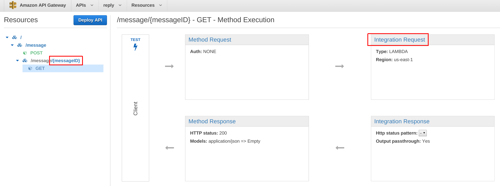
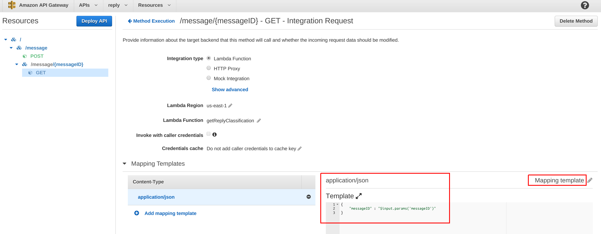

With a new support for Java; Lambda has become a very good candidate for implementing many of the microservices 
(and providing a RESTful interface via API Gateway).  
However the documentation on how to connect them is still lacking. 
A key point is to implement the RequestHandler interface as described in the official docs; 
note that you will need to create custom Request and Response objects; using generic ones (e.g. String) would thrown an exception.

This is a seed application.

# Lambda

## Building

First you'll need to package your program.  You can do that by executing:
* `sbt assembly`

(note the output path; you'll need to grab that jar later)


## Setup

Go to console; and create a new `lambda` function.

* runtime: `Java 8`
* upload a .ZIP file: `jar` produced by the `sbt assembly`; e.g. `target/scala-2.11/aws-lambda-scala-api-gateway-assembly-1.0.jar `
* handler: specify a full quantified class name (no need to included the method): e.g.: `org.activeintel.lambda.seed.post.Handler` 
    (for `get` use handler from another corresponding package `...seed.get.Handler`) 
* role: create `basic execution role` (if you haven't already)


After your lambda function has been created; make sure that it run by doing a `test` from AWS console.


# Integration of Lambda and API Gateway


From `API Gateway` console; select your function 
(note that doing this from `lambda` console `API Endpoints` will result in exception; since some of the permissions don't get set up properly)


## POST

For testing, make sure to include corresponding bodies through `API Gateway`, and `Lambda`
e.g. pass the following in the `Request Body`:

```
{ 
    "firstName": "John",
     "lastName": "Doe" 
}  
```


## GET

When creating resource; you'll need to encode part of the path which is used as argument; e.g. `{messageID}` 


You'll also need to add mapping rules to get the argument under `Integration Request`



In the mapping section; select `mapping template` and add e.g.:

```
{
    "messageID" : "$input.params('messageID')"
}
```




for more information see: http://docs.aws.amazon.com/apigateway/latest/developerguide/api-gateway-mapping-template-reference.html


## Enable CORS for a Method in API Gateway

You'll probably need to allow cross-domain call; to do that please follow: http://docs.aws.amazon.com/apigateway/latest/developerguide/how-to-cors.html

NOTE: the documentation is a little confusing; see this post (by Stefano@AWS) for clarifications: https://forums.aws.amazon.com/thread.jspa?messageID=644489&


# Give Lambda Permissions to AWS Resources

Simplest way is to configure through `IAM/Roles/Create Role Policy`
 
p.s. you can look up the `role` name of your lambda see `Lambda/Functions/YOUR-Function/Configuration/Role` 


# See Also

http://docs.aws.amazon.com/lambda/latest/dg/java-handler-io-type-pojo.html


### Keywords:

java lambda scala aws amazon api gateway rest restful


### Exceptions
```
XMLHttpRequest cannot load https://ddd.execute-api.us-east-1.amazonaws.com/test/data. Response to preflight request doesn't pass access control check: No 'Access-Control-Allow-Origin' header is present on the requested resource. Origin 'http://ddd.s3-website-us-east-1.amazonaws.com' is therefore not allowed access. The response had HTTP status code 403.

```


```
{
"message": "Missing Authentication Token"
}
```

```
                Execution log for request test-request
Sun Oct 04 04:40:30 UTC 2015 : Starting execution for request: test-invoke-request
Sun Oct 04 04:40:30 UTC 2015 : API Key: test-invoke-api-key
Sun Oct 04 04:40:30 UTC 2015 : Method request path: {}
Sun Oct 04 04:40:30 UTC 2015 : Method request query string: {}
Sun Oct 04 04:40:30 UTC 2015 : Method request headers: {}
Sun Oct 04 04:40:30 UTC 2015 : Method request body before transformations: null
Sun Oct 04 04:40:30 UTC 2015 : Endpoint request URI: 
https://lambda.us-east-1.amazonaws.com/2015-03-31/functions/arn:aws:lambda:us-east-1:function:testFunction/invocations
Sun Oct 04 04:40:30 UTC 2015 : Endpoint request headers: 
{Authorization=*******************************************************************************************************************************************************************************************************************************, 
X-Amz-Date=20151004T044030Z, X-Amz-Source-Arn=arn:aws:execute-api:us-east-1:/null/POST/testMessage, 
Accept=application/json, User-Agent=AmazonAPIGateway, Host=lambda.us-east-1.amazonaws.com}
Sun Oct 04 04:40:30 UTC 2015 : Endpoint request body after transformations: 
Sun Oct 04 04:40:30 UTC 2015 : Execution failed due to configuration error: Invalid permissions on Lambda function
```


```
{
"Type": "User",
"message": "Could not parse request body into json."
}rialize instance of java.lang.String out of START_OBJECT token\n at [Source: lambdainternal.util.NativeMemoryAsInputStream@3224f60b; line: 1, column: 1]",
"errorType": "com.fasterxml.jackson.databind.JsonMappingException",
"stackTrace": [
"com.fasterxml.jackson.databind.JsonMappingException.from(JsonMappingException.java:148)",
"com.fasterxml.jackson.databind.DeserializationContext.mappingException(DeserializationContext.java:835)",
"com.fasterxml.jackson.databind.deser.std.StringDeserializer.deserialize(StringDeserializer.java:59)",
"com.fasterxml.jackson.databind.deser.std.StringDeserializer.deserialize(StringDeserializer.java:12)",
"com.fasterxml.jackson.databind.ObjectReader._bindAndClose(ObjectReader.java:1441)",
"com.fasterxml.jackson.databind.ObjectReader.readValue(ObjectReader.java:1047)"
]
}
}
}n."
}

{
"errorMessage": "An error occurred during JSON parsing",
"errorType": "java.lang.RuntimeException",
"stackTrace": [],
"cause": {
"errorMessage": "com.fasterxml.jackson.databind.JsonMappingException: Can not deserialize instance of java.lang.String out of START_OBJECT token\n at [Source: lambdainternal.util.NativeMemoryAsInputStream@72b6cbcc; line: 1, column: 1]",
"errorType": "java.io.UncheckedIOException",
"stackTrace": [],
"cause": {
"errorMessage": "Can not deserialize instance of java.lang.String out of START_OBJECT token\n at [Source: lambdainternal.util.NativeMemoryAsInputStream@72b6cbcc; line: 1, column: 1]",
"errorType": "com.fasterxml.jackson.databind.JsonMappingException",
"stackTrace": [
"com.fasterxml.jackson.databind.JsonMappingException.from(JsonMappingException.java:148)",
"com.fasterxml.jackson.databind.DeserializationContext.mappingException(DeserializationContext.java:835)",
"com.fasterxml.jackson.databind.deser.std.StringDeserializer.deserialize(StringDeserializer.java:59)",
"com.fasterxml.jackson.databind.deser.std.StringDeserializer.deserialize(StringDeserializer.java:12)",
"com.fasterxml.jackson.databind.ObjectReader._bindAndClose(ObjectReader.java:1441)",
"com.fasterxml.jackson.databind.ObjectReader.readValue(ObjectReader.java:1047)"
]
}
}
}rialize instance of java.lang.String out of START_OBJECT token\n at [Source: lambdainternal.util.NativeMemoryAsInputStream@3224f60b; line: 1, column: 1]",
"errorType": "com.fasterxml.jackson.databind.JsonMappingException",
"stackTrace": [
"com.fasterxml.jackson.databind.JsonMappingException.from(JsonMappingException.java:148)",
"com.fasterxml.jackson.databind.DeserializationContext.mappingException(DeserializationContext.java:835)",
"com.fasterxml.jackson.databind.deser.std.StringDeserializer.deserialize(StringDeserializer.java:59)",
"com.fasterxml.jackson.databind.deser.std.StringDeserializer.deserialize(StringDeserializer.java:12)",
"com.fasterxml.jackson.databind.ObjectReader._bindAndClose(ObjectReader.java:1441)",
"com.fasterxml.jackson.databind.ObjectReader.readValue(ObjectReader.java:1047)"
]
}
}
}n."
}

{
"errorMessage": "An error occurred during JSON parsing",
"errorType": "java.lang.RuntimeException",
"stackTrace": [],
"cause": {
"errorMessage": "com.fasterxml.jackson.databind.JsonMappingException: Can not deserialize instance of java.lang.String out of START_OBJECT token\n at [Source: lambdainternal.util.NativeMemoryAsInputStream@7494e528; line: 1, column: 1]",
"errorType": "java.io.UncheckedIOException",
"stackTrace": [],
"cause": {
"errorMessage": "Can not deserialize instance of java.lang.String out of START_OBJECT token\n at [Source: lambdainternal.util.NativeMemoryAsInputStream@7494e528; line: 1, column: 1]",
"errorType": "com.fasterxml.jackson.databind.JsonMappingException",
"stackTrace": [
"com.fasterxml.jackson.databind.JsonMappingException.from(JsonMappingException.java:148)",
"com.fasterxml.jackson.databind.DeserializationContext.mappingException(DeserializationContext.java:835)",
"com.fasterxml.jackson.databind.deser.std.StringDeserializer.deserialize(StringDeserializer.java:59)",
"com.fasterxml.jackson.databind.deser.std.StringDeserializer.deserialize(StringDeserializer.java:12)",
"com.fasterxml.jackson.databind.ObjectReader._bindAndClose(ObjectReader.java:1441)",
"com.fasterxml.jackson.databind.ObjectReader.readValue(ObjectReader.java:1047)"
]
}
}
}

```

